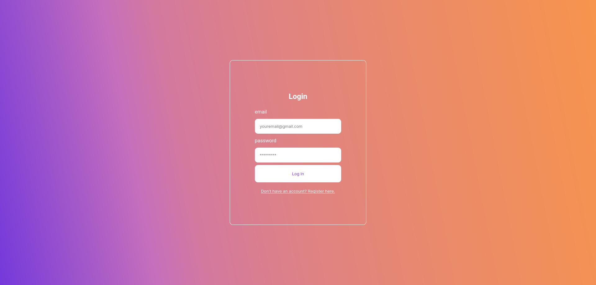
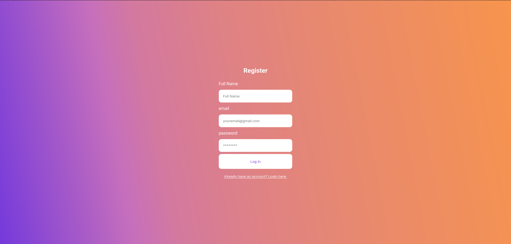

# Getting Started with Create React App

This project was bootstrapped with [Create React App](https://github.com/facebook/create-react-app).


## Run Locally

Clone the project

```bash
  git clone https://link-to-project
```

Go to the project directory

```bash
  cd my-project
```

Install dependencies

```bash
  npm install
```

Start the server

```bash
  npm run start
```


## Screenshots

### Login Page


### Register Page


## Acknowledgement
- [Click here to watch the YouTube video of this tutorial.](https://www.youtube.com/watch?v=Y-XW9m8qOis)

